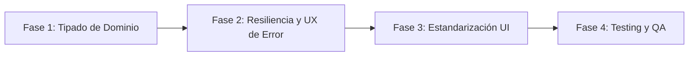

# ADR-0001: Remediación, Tipado Estricto y Optimización UX del Módulo Home Ejecutivo en KOFIX

## Estado
Aceptado

## Fecha
2026-09-23

## Contexto
El módulo `/main/home` ([`HomeComponent`](file:///home/opazos/MyProjects/AGROIDEAS/UI_MONO_REPO/agroideas-frontend-monorepo/apps/kofix-ejecucion/src/app/presentation/pages/home/home.component.ts)) actúa como el tablero gerencial y punto de entrada operativo para el sistema `kofix-ejecucion`. Este módulo centraliza los indicadores clave de desempeño (KPIs) de los convenios institucionales y las comparativas de ejecución presupuestal programada vs. ejecutada en base anual y mensual.

Tras un análisis exhaustivo de su arquitectura técnica y experiencia de usuario, se identificaron tres oportunidades críticas de mejora:

1. **Ausencia de Tipado Estricto (Uso de `any`):**
   - En el repositorio de dominio ([`ConvenioRepository`](file:///home/opazos/MyProjects/AGROIDEAS/UI_MONO_REPO/agroideas-frontend-monorepo/apps/kofix-ejecucion/src/app/domain/repositories/convenio.repository.ts)) los métodos `getResumenEjecutivo()` y `getReporteMensual(anio)` retornan `Observable<any>`.
   - En [`ConvenioRepositoryImpl`](file:///home/opazos/MyProjects/AGROIDEAS/UI_MONO_REPO/agroideas-frontend-monorepo/apps/kofix-ejecucion/src/app/data/repositories/convenio.repository.impl.ts) se mapea sobre `ResponseDto<any>`.
   - En la página ([`HomeComponent`](file:///home/opazos/MyProjects/AGROIDEAS/UI_MONO_REPO/agroideas-frontend-monorepo/apps/kofix-ejecucion/src/app/presentation/pages/home/home.component.ts)) las señales de estado `resumenData` y `chartData` están tipadas como `signal<any>(null)` y `signal<any[]>([])`, y en el cómputo de `donutData` se realizan castings `(d: any)`.
   - Aunque existe una interfaz parcial [`ResumenEjecutivoData`](file:///home/opazos/MyProjects/AGROIDEAS/UI_MONO_REPO/agroideas-frontend-monorepo/apps/kofix-ejecucion/src/app/presentation/components/resumen-ejecutivo/resumen-ejecutivo.component.ts#L4-L10) dentro del componente presentacional, está aislada y no permea a las capas de Dominio ni Data.

2. **Manejo Silencioso de Errores y Falta de Resiliencia en la UI:**
   - Si la API `.NET` (`apiEjecucion`) experimenta una interrupción (500, timeout, 401/403 no manejado), los callbacks de error de las peticiones en [`HomeComponent`](file:///home/opazos/MyProjects/AGROIDEAS/UI_MONO_REPO/agroideas-frontend-monorepo/apps/kofix-ejecucion/src/app/presentation/pages/home/home.component.ts#L56-L60) únicamente apagan las banderas de carga (`loadingResumen.set(false)`, `loadingChart.set(false)`).
   - No se emite ninguna notificación visual (Toast/Alert mediante [`AlertService`](file:///home/opazos/MyProjects/AGROIDEAS/UI_MONO_REPO/agroideas-frontend-monorepo/libs/feedback/src/lib/alert.service.ts)) ni se muestra un bloque de reintento (`retry`) en la plantilla HTML, dejando la pantalla en un estado en blanco o inconsistente.

3. **Inconsistencia Visual con el Design System Monorepo (`@agroideas/ui`):**
   - El componente [`ResumenEjecutivoComponent`](file:///home/opazos/MyProjects/AGROIDEAS/UI_MONO_REPO/agroideas-frontend-monorepo/apps/kofix-ejecucion/src/app/presentation/components/resumen-ejecutivo/resumen-ejecutivo.component.ts) implementa estilos SASS manuales (`tile-card`, `tile-card--green`, etc.) en lugar de reutilizar [`UiKpiComponent`](file:///home/opazos/MyProjects/AGROIDEAS/UI_MONO_REPO/agroideas-frontend-monorepo/libs/ui/src/lib/ui-kpi/ui-kpi.component.ts), el cual es el estándar corporativo utilizado en los módulos de `sat-ui` y `sigec-rtf`.

---

## Decisión

Se aprueba implementar una refactorización estructural y progresiva del módulo `Home` organizada en 4 fases, guiada por los siguientes acuerdos:

### 1. Definición Formal de Modelos de Dominio
Se centralizarán los contratos de datos en [`convenio.model.ts`](file:///home/opazos/MyProjects/AGROIDEAS/UI_MONO_REPO/agroideas-frontend-monorepo/apps/kofix-ejecucion/src/app/domain/models/convenio.model.ts):
- `ResumenEjecutivo`: Modelo inmutable para las métricas de convenios y saldos.
- `ReporteMensualItem`: Representación mensual tipada (`mes`, `programado`, `ejecutado`).
- `ReporteMensualResponse`: Estructura devuelta por el servicio conteniendo el array mensual y metadatos asociados.

Se actualizará la firma en [`ConvenioRepository`](file:///home/opazos/MyProjects/AGROIDEAS/UI_MONO_REPO/agroideas-frontend-monorepo/apps/kofix-ejecucion/src/app/domain/repositories/convenio.repository.ts) y [`ConvenioRepositoryImpl`](file:///home/opazos/MyProjects/AGROIDEAS/UI_MONO_REPO/agroideas-frontend-monorepo/apps/kofix-ejecucion/src/app/data/repositories/convenio.repository.impl.ts) sustituyendo todos los usos de `any` por sus modelos correspondientes.

### 2. Gestión de Estados de Error y Mecanismo de Reintento
- En [`HomeComponent`](file:///home/opazos/MyProjects/AGROIDEAS/UI_MONO_REPO/agroideas-frontend-monorepo/apps/kofix-ejecucion/src/app/presentation/pages/home/home.component.ts), se incorporarán señales para captura de fallos:
  - `errorResumen = signal<string | null>(null)`
  - `errorChart = signal<string | null>(null)`
- Se integrará [`AlertService`](file:///home/opazos/MyProjects/AGROIDEAS/UI_MONO_REPO/agroideas-frontend-monorepo/libs/feedback/src/lib/alert.service.ts) para alertas discretas (toast o mensaje de aviso al usuario cuando la conexión falle).
- Se diseñarán contenedores de fallback en la plantilla con botón "Reintentar conexión" que invoque nuevamente la carga del recurso fallido.

### 3. Alineación con el Design System Corporativo
- Migrar las tarjetas de métricas en [`ResumenEjecutivoComponent`](file:///home/opazos/MyProjects/AGROIDEAS/UI_MONO_REPO/agroideas-frontend-monorepo/apps/kofix-ejecucion/src/app/presentation/components/resumen-ejecutivo/resumen-ejecutivo.component.html) al componente [`UiKpiComponent`](file:///home/opazos/MyProjects/AGROIDEAS/UI_MONO_REPO/agroideas-frontend-monorepo/libs/ui/src/lib/ui-kpi/ui-kpi.component.ts) de `@agroideas/ui`, aprovechando sus variantes (`primary`, `success`, `warning`, `info`) y slots semánticos.
- Preservar los componentes SVG personalizados [`ReporteMensualChartComponent`](file:///home/opazos/MyProjects/AGROIDEAS/UI_MONO_REPO/agroideas-frontend-monorepo/apps/kofix-ejecucion/src/app/presentation/components/reporte-mensual-chart/reporte-mensual-chart.component.ts) y [`ReporteMensualDonutComponent`](file:///home/opazos/MyProjects/AGROIDEAS/UI_MONO_REPO/agroideas-frontend-monorepo/apps/kofix-ejecucion/src/app/presentation/components/reporte-mensual-donut/reporte-mensual-donut.component.ts) por su alta eficiencia y ligereza, vinculando sus variables de color a los tokens HSL de `@agroideas/theme`.

---

## Consecuencias

### Positivas
- **Seguridad en Tiempo de Compilación:** Detección inmediata de cambios de contrato con el backend; eliminación del riesgo de `undefined` inadvertidos en plantillas.
- **Experiencia de Usuario Resiliente:** El usuario ya no quedará frente a pantallas congeladas o vacías ante caídas temporales de la API; contará con diagnóstico claro y botón de reintento.
- **Homogeneidad Visual:** Reducción del CSS propietario en favor del Design System corporativo (`@agroideas/ui`), facilitando el mantenimiento conjunto con los demás proyectos del monorepo (`sat-ui`, `sigec-rtf`).
- **Mayor Cobertura de Pruebas:** Permite tests unitarios con aserciones semánticas sobre estados de error, reintentos y tipos específicos.

### Riesgos y Mitigación
- **Cambios en payloads del Backend:** Si la API devuelve propiedades nulas o con nombres dispares en el backend legacy, se implementarán mappers seguros con valores por defecto.
- **Retrocompatibilidad de Tests:** La actualización de tipos e interfaces requerirá actualizar los mocks en [`home.component.spec.ts`](file:///home/opazos/MyProjects/AGROIDEAS/UI_MONO_REPO/agroideas-frontend-monorepo/apps/kofix-ejecucion/src/app/presentation/pages/home/home.component.spec.ts).

---

## Plan de Implementación por Fases

### Fase 1: Dominio y Contratos Fuertemente Tipados (Estimación: Inmediata)
1. **Definir Interfaces:**
   - Declarar `ResumenEjecutivo` y `ReporteMensualItem` en [`src/app/domain/models/convenio.model.ts`](file:///home/opazos/MyProjects/AGROIDEAS/UI_MONO_REPO/agroideas-frontend-monorepo/apps/kofix-ejecucion/src/app/domain/models/convenio.model.ts).
2. **Actualizar Repositorios:**
   - Modificar las firmas en [`ConvenioRepository`](file:///home/opazos/MyProjects/AGROIDEAS/UI_MONO_REPO/agroideas-frontend-monorepo/apps/kofix-ejecucion/src/app/domain/repositories/convenio.repository.ts) y [`ConvenioRepositoryImpl`](file:///home/opazos/MyProjects/AGROIDEAS/UI_MONO_REPO/agroideas-frontend-monorepo/apps/kofix-ejecucion/src/app/data/repositories/convenio.repository.impl.ts) para usar `Observable<ResumenEjecutivo>` y `Observable<{ reporte: ReporteMensualItem[] }>`.
3. **Refactorizar Smart Component:**
   - Tipar `resumenData = signal<ResumenEjecutivo | null>(null)` y `chartData = signal<ReporteMensualItem[]>([])` en [`HomeComponent`](file:///home/opazos/MyProjects/AGROIDEAS/UI_MONO_REPO/agroideas-frontend-monorepo/apps/kofix-ejecucion/src/app/presentation/pages/home/home.component.ts).

### Fase 2: Resiliencia de Errores y Retroalimentación al Usuario
1. **Manejo de Errores Reactivo:**
   - Crear señales `errorResumen` y `errorChart` en [`HomeComponent`](file:///home/opazos/MyProjects/AGROIDEAS/UI_MONO_REPO/agroideas-frontend-monorepo/apps/kofix-ejecucion/src/app/presentation/pages/home/home.component.ts).
   - Inyectar [`AlertService`](file:///home/opazos/MyProjects/AGROIDEAS/UI_MONO_REPO/agroideas-frontend-monorepo/libs/feedback/src/lib/alert.service.ts) para emitir notificaciones toast no intrusivas en caso de falla de red.
2. **UI de Fallback y Reintento:**
   - Integrar componentes de error en [`home.component.html`](file:///home/opazos/MyProjects/AGROIDEAS/UI_MONO_REPO/agroideas-frontend-monorepo/apps/kofix-ejecucion/src/app/presentation/pages/home/home.component.html) con botón "Reintentar" para permitir recuperar los datos sin necesidad de recargar la página completa.

### Fase 3: Estandarización Visual con `@agroideas/ui`
1. **Adopción de `UiKpiComponent`:**
   - En [`ResumenEjecutivoComponent`](file:///home/opazos/MyProjects/AGROIDEAS/UI_MONO_REPO/agroideas-frontend-monorepo/apps/kofix-ejecucion/src/app/presentation/components/resumen-ejecutivo/resumen-ejecutivo.component.ts), reemplazar el markup manual `tile-card` por `<app-ui-kpi>` de `@agroideas/ui`.
   - Mapear las 4 métricas hacia las variantes semánticas:
     - Convenios Activos: `variant="info"` o `variant="primary"`
     - Programación Acumulada: `variant="default"`
     - Ejecución Acumulada: `variant="success"`
     - Saldo Disponible: `variant="warning"`
2. **Optimización de Tokens de Tema:**
   - Asegurar que los componentes SVG (`reporte-mensual-chart` y `reporte-mensual-donut`) consuman clases de Tailwind mapeadas a `@agroideas/theme`.

### Fase 4: Testing, Linting y Aceptación
1. **Actualización de Pruebas Unitarias:**
   - Ajustar mocks y añadir pruebas para los nuevos estados de error y reintento en [`home.component.spec.ts`](file:///home/opazos/MyProjects/AGROIDEAS/UI_MONO_REPO/agroideas-frontend-monorepo/apps/kofix-ejecucion/src/app/presentation/pages/home/home.component.spec.ts).
   - Crear specs para [`ResumenEjecutivoComponent`](file:///home/opazos/MyProjects/AGROIDEAS/UI_MONO_REPO/agroideas-frontend-monorepo/apps/kofix-ejecucion/src/app/presentation/components/resumen-ejecutivo/resumen-ejecutivo.component.spec.ts) verificando la integración con `UiKpiComponent`.
2. **Verificación Automatizada:**
   - Ejecutar `npx nx test kofix-ejecucion` y `npx nx lint kofix-ejecucion` garantizando 0 errores y cumplimiento de los límites de módulos.
