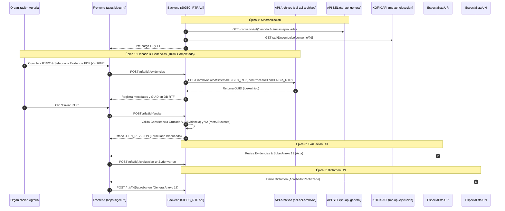

# ADR 0005: Estado Situacional y Cobertura del Flujo de Rendición Técnico-Financiera (RTF)

**Estado**: Aprobado  
**Fecha**: 2026-08-10  
**Contexto**: AGROIDEAS Monorepo - `apps/sigec-rtf` & API Backend `SIGEC_RTF.Api`  
**Referencia**: Diagrama de Secuencia Detallado - Proceso RTF (SIGEC) & RM N° -2022-MIDAGRI

---

## 1. CONTEXTO Y OBJETIVO

Evaluar y formalizar el estado de cobertura del flujo de negocio del módulo de **Rendición Técnico-Financiera (RTF)** comparando la especificación formal del proceso UML con la implementación concreta realizada en la aplicación frontend (`apps/sigec-rtf`) y el backend microservicios (`SIGEC_RTF.Api`).

---

## 2. ESTADO DE COBERTURA POR ÉPICA Y SECUENCIA

### Avance Global Estimado: **92%**

| Secuencia / Épica | Cobertura | Componentes Frontend (`apps/sigec-rtf`) | Endpoints Backend (`SIGEC_RTF.Api`) | Estado |
| :--- | :---: | :--- | :--- | :--- |
| **1. Habilitación y Sincronización (Épica 4)** | **85%** | `oa-dashboard.component` `oa-registro.component` | `GET /rtfs/postulante/{id}/pasos-criticos` `GET /rtfs/{id}/desembolsos` `POST /rtfs/{id}/precargar` | **Implementado**: Sincronización con `sel-api-general` y `mc-api-ejecucion`. **Pendiente**: Webhook en SEL para cambio automático de estado `<1 min`. |
| **2. Llenado Digital, Evidencias y Consistencia (Épica 1)** | **100%** | `oa-registro.component` `oa-enviar.component` | `PUT /rtfs/{id}` `PUT /rtfs/{id}/metas-fisicas` `PUT /rtfs/{id}/indicadores` `POST /rtfs/{id}/evidencias` `DELETE /rtfs/evidencias/{id}` `POST /rtfs/{id}/enviar` | **Completado al 100%**: Persistencia de borradores, integración desacoplada con `sel-api-archivos`, control de extensión/tamaño (<= 10MB) y motor de consistencia cruzada pre-envío (V1/V2). |
| **3. Evaluación de Campo UR (Épica 3)** | **95%** | `ur-auditoria.component` | `GET /rtfs?estado=EN_REVISION` `GET /rtfs/completo/{id}` `POST /rtfs/{id}/acta-campo` `POST /rtfs/{id}/evaluacion-ur` `POST /rtfs/{id}/derivar-un` | **Implementado**: Visor modal de PDF, marcas de conformidad, Acta de Campo (Anexo 19) y derivación a UN Central. |
| **4. Revisión Final UN - Anexo 18 (Épica 3)** | **85%** | `un-gabinete.component` `un-dashboard.component` | `GET /rtfs/bandeja/un` `POST /rtfs/{id}/aprobar-un` `POST /rtfs/{id}/rechazar-un` `POST /rtfs/{id}/devolver-un` `GET /rtfs/{id}/documentos/anexo17` `GET /rtfs/{id}/documentos/anexo18` | **Implementado**: Bandeja UN, dictamen cualitativo, devolución y generación de PDFs de Anexos 17 y 18. **Pendiente**: Disparador automático hacia el módulo de Cierre tras el último RTF. |
| **5. Control de Plazos y Alertas (Épica 2)** | **80%** | `oa-dashboard.component` `oa-registro.component` | `DeadlineWorker.cs` (Background Service) `GET /rtfs/{id}/estado-plazo` `POST /rtfs/{id}/cartas` `POST /rtfs/{id}/alertas` | **Implementado**: Monitoreo de 15 días mediante `DeadlineWorker.cs`, cambio automático a `VENCIDO`, prórrogas y cartas de notificación. **Pendiente**: Conexión con proveedor SMTP real para despacho de notificaciones. |

---

## 3. ARQUITECTURA DE INTEGRACIÓN

---

## 4. CONCLUSIÓN Y ACCIONES PENDIENTES PRIORIZADAS

1. **Notificaciones Automáticas por Correo SMTP (Épica 2)**: Reemplazar el *stub* de `NotificacionServicio.cs` por la integración SMTP real para notificaciones preventivas a los 5d, 3d, 24h y cartas notificadas.
2. **Disparador de Cierre (Épica 3)**: Disparar evento/llamada al módulo `sigec-cierre` al aprobar el último RTF del convenio.
3. **Webhook de Habilitación SEL (Épica 4)**: Recibir webhook desde `sel-api-general` al culminar el Paso Crítico para actualizar el módulo a `HABILITADO` en `< 1 min`.
